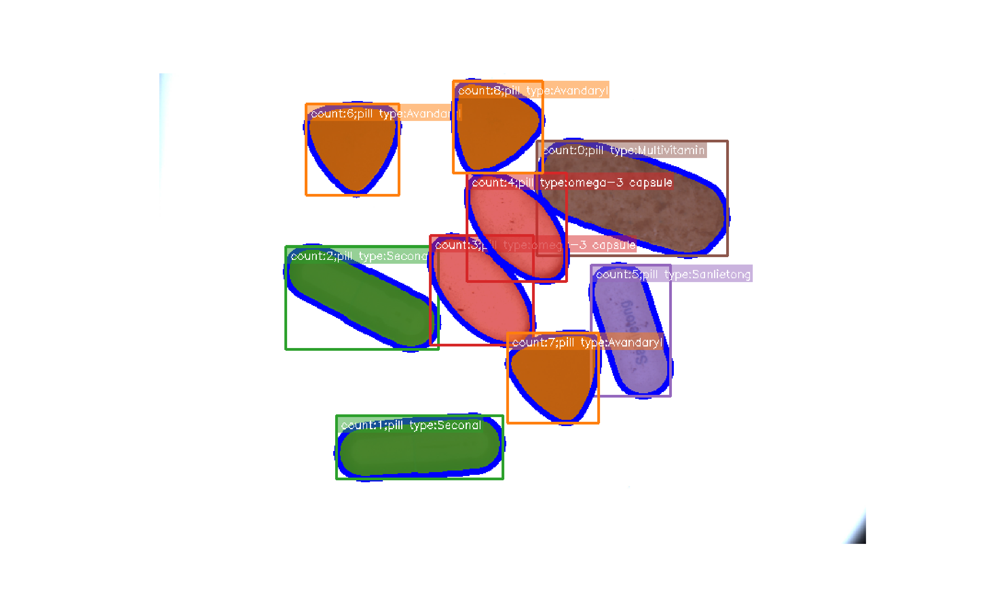

# Pill Segmentation
**Pill segmentation and identification based on SAM and CV methods** - *HKCLR project*
[Slides link](https://docs.google.com/presentation/d/1cvHs3yDYXDYpVMvbUnwmaOJ5_cr2wuo5/edit?usp=sharing&ouid=102584246414142756431&rtpof=true&sd=true)

### System Dependencies:
- python >= 3.8
- NVIDIA driver >= 460.32
- Cuda toolkit >= 10.1

### Steps:

1. Create a python virtual environment `virtualenv pill_seg --python=python3.8`

1. Install Segment Anything Model from(SAM):https://github.com/facebookresearch/segment-anything

2. Install MVS Terminal from HIKROBOT: https://www.hikrobotics.com/en 

3. Include 'MVS\Development\Samples\Python\MvImport' to the system path (See https://www.cnblogs.com/miracle-luna/p/16960556.html)

3. run the following command from this directory: `pip install -r requirements.txt` . 

### Run:

1. Attach the HIKRobot camera to the computer

2. Run `python pill_seg.py` from this directory

3. Should produce a image like the following one

  

1. Press 'space' for updating the segmentation. Press 'q' to quit. 

_For more information, please see_this [website](https://respected-bonobo-427.notion.site/Pill-Segmentation-3f387c40fc964004b357cac9261e744d?pvs=4)